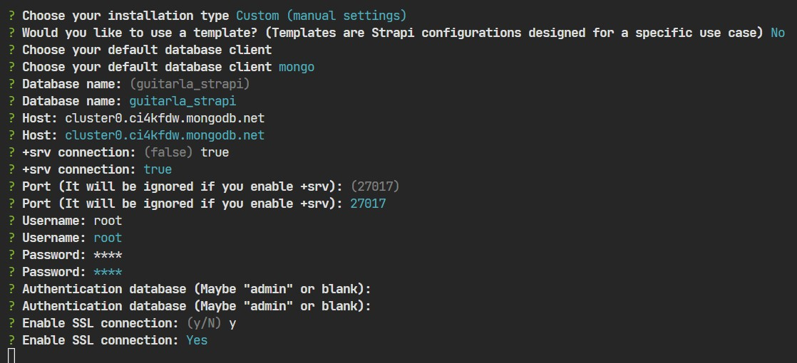
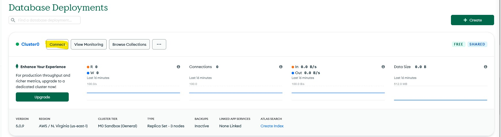
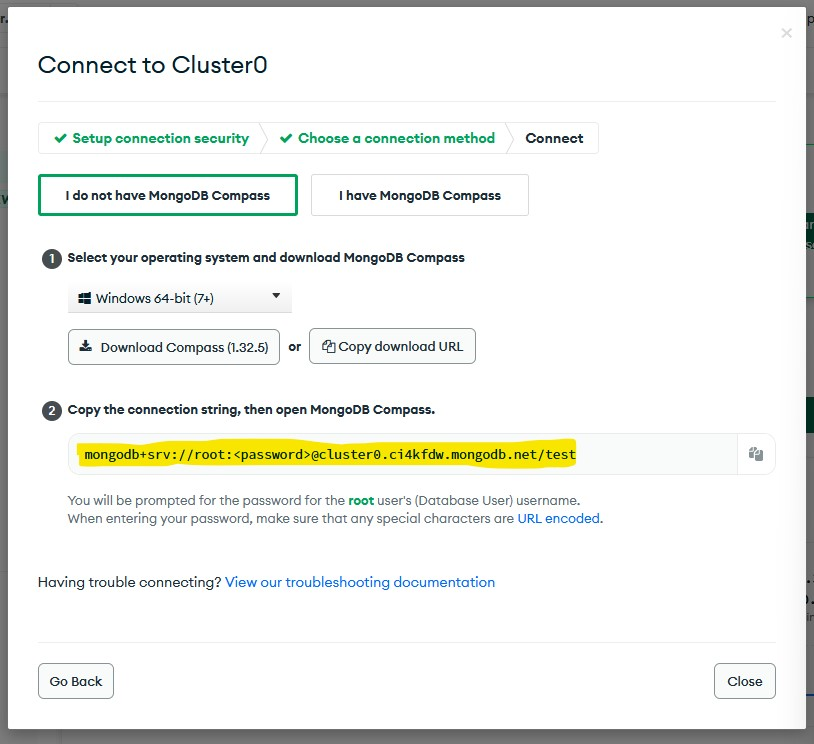
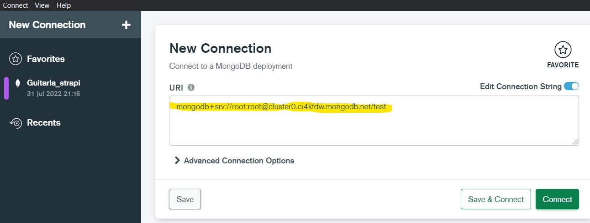
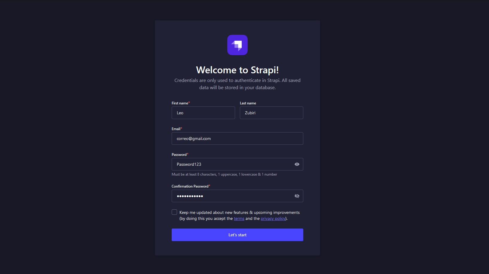
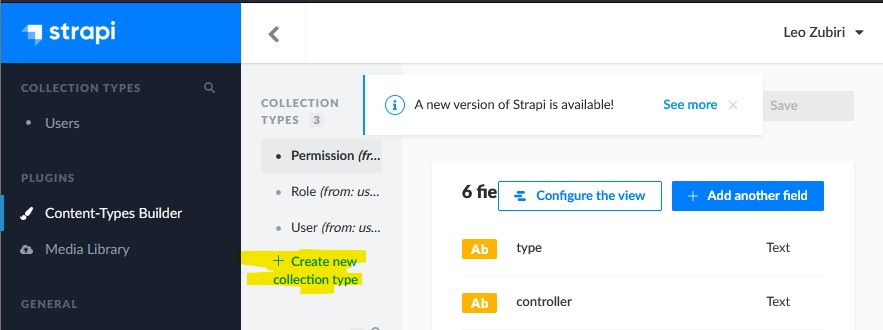
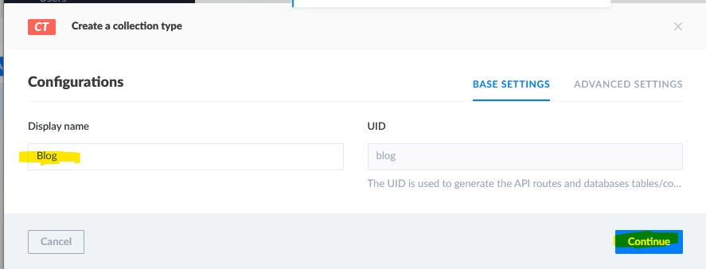
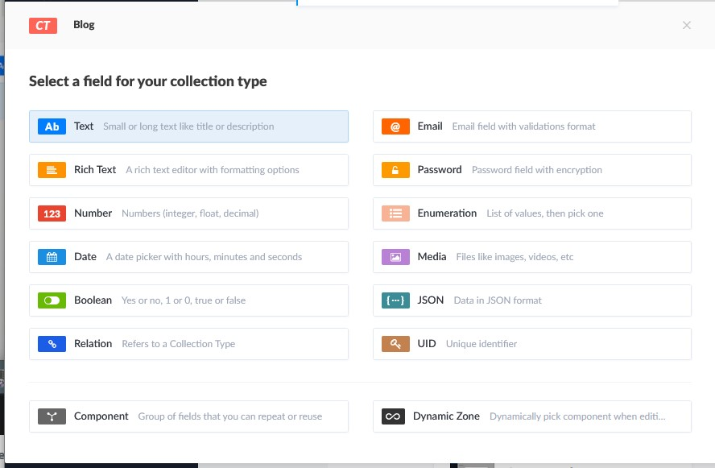
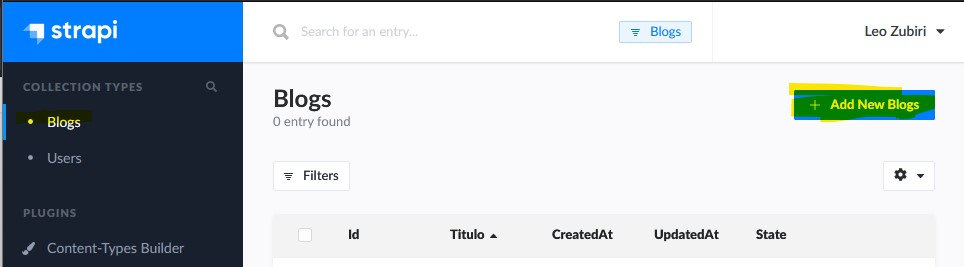
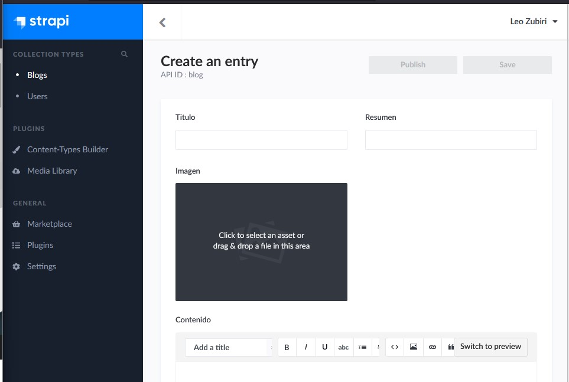

## **Crear Proyecto NEXT JS**

[**Acerca de next ->**](./ABOUT_NEXT.md)

```npx create-next-app@latest```

**Ejecutar proyecto:** ```npm run dev```

---


---

## **Routing**

Se utiliza la carpeta **pages** para todas las rutas a las que accederemos.
Por ejemplo: pages/nosotros.js -> localhost:3000/nosotros

No se necesita algo como es el react router. Para preservar el comportamiento de evitar la recarga de la página al interactuar con esta:

```js

// Hay componentes creados para next
import Link from 'next/link'

...

<Link href='/nosotros'> Ir a Nosotros </Link>

```

---

## **Head en Next**
> El componente Head equivale a la etiqueta head de html, por lo que ahí se puede colocar la etiqueta title entre otras. 
> Donde se importe se hará referencia a ese contenido.

```js
import Head from 'next/head'
...

<Head> 
    <title>Guitar LA- {pagina}</title>
    <meta name='description' content='Sitio Web de venta de guitarras' />
</Head>
```

**Link para el Routing**
```js
import Link from 'next/link'
...

```

---

## **Módulos CSS**
Crear **componente.module.css**

```js
// Para importar el modulo de css
import styles from '../styles/Header.module.css'

...

// Para aplicar las clases

<h1 className={styles.h1}>  </h1>
```
---

## **Imagenes en next**

```js
// Las imagenes estan en la carpeta public
import Image from 'next/image';

...

// Next ya apunta a la raiz de la carpeta public, height y width obligatorio
 <Image width={400} height={100} src='/img/logo.svg' alt='logo'/>

 // Layout
 <Image layout='' src='' alt=''/>
 // fill - ocupa todo el ancho de la pantalla
 // responsive - Se ajusta el tamaño a la redimensión de la ventana, ancho y alto
 // instrinsic - Escala solo en el ancho de la pantalla
 // fixed - la imagen se queda fija a un tamaño establecido

```

---

## [**Strapi**](https://strapi.io/)
CMS Headless 
- Permite crear API´s dinamicas con respuestas JSON o graphql

> Un CMS (Content Management System) o Sistema de Gestión de Contenidos es un sistema online que permite poner en marcha una página web de forma sencilla y rápida. Se trata de un software que te ayuda a administrar contenidos dinámicos, por ejemplo, un blog, un ecommerce o cualquier tipo de página web.


## **Strapi y Bases de datos**
Soporta
- sqlite
- Postgre
- Mongo

### **Para usar Mongo**
Servicio en nube para pruebas:
[Crear cuenta y base de datos en MongoDB Atlas](https://www.mongodb.com/atlas/database)

**Instalación** <br>

```npx create-strapi-app  npx create-strapi-app@3.6.8```

Existe hasta la version 4. En el caso de la v3, se utiliza node <= v14.0

1. Custom Installation
2. No template
3. mongo db client
4. set database name







Desde MongoCompass:


**Ejecución** <br>
Una vez creado el proyecto para ejecutar, desde la ruta del proyecto: <br>

```npm run develop```

Se inicia un login para el proyecto:



---

## **Tipos de Contenido strapi**











https://cloudinary.com/

https://www.npmjs.com/package/@strapi/provider-upload-cloudinary

npm i @strapi/provider-upload-cloudinary

config/plugins.js

---

## Consultar APIs con NEXT


/** @type {import('next').NextConfig} */
const nextConfig = {
  reactStrictMode: true,
  swcMinify: true,
  images:{
    domains:['localhost']
  }
}

module.exports = nextConfig


.resumen{
    display: -webkit-box;
    -webkit-box-orient: vertical;
    -webkit-line-clamp: 3;  
    overflow: scroll;
}
