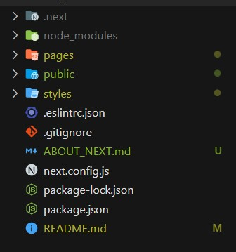

## **Crear Proyecto NEXT JS**

[**Acerca de next ->**](./ABOUT_NEXT.md)

```npx create-next-app@latest```

**Ejecutar proyecto:** ```npm run dev```

---



---

## **Routing**

Se utiliza la carpeta **pages** para todas las rutas a las que accederemos.
Por ejemplo: pages/nosotros.js -> localhost:3000/nosotros

No se necesita algo como es el react router. Para preservar el comportamiento de evitar la recarga de la página al interactuar con esta:

```js

// Hay componentes creados para next
import Link from 'next/link'

...

<Link href='/nosotros'> Ir a Nosotros </Link>

```

---

## **Head en Next**
> El componente Head equivale a la etiqueta head de html, por lo que ahí se puede colocar la etiqueta title entre otras. 
> Donde se importe se hará referencia a ese contenido.

```js
import Head from 'next/head'
...

<Head> 
    <title>Guitar LA- {pagina}</title>
    <meta name='description' content='Sitio Web de venta de guitarras' />
</Head>
```

**Link para el Routing**
```js
import Link from 'next/link'
...

```

---

## **Módulos CSS**
Crear **componente.module.css**

```js
// Para importar el modulo de css
import styles from '../styles/Header.module.css'

...

// Para aplicar las clases

<h1 className={styles.h1}>  </h1>
```