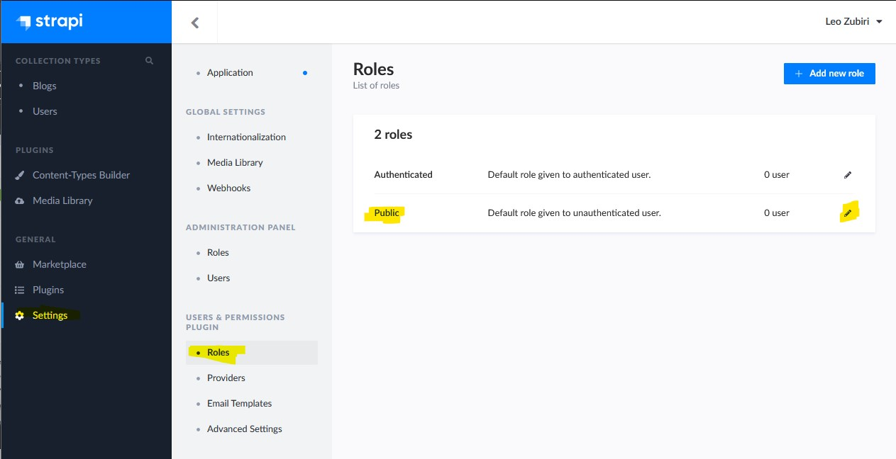
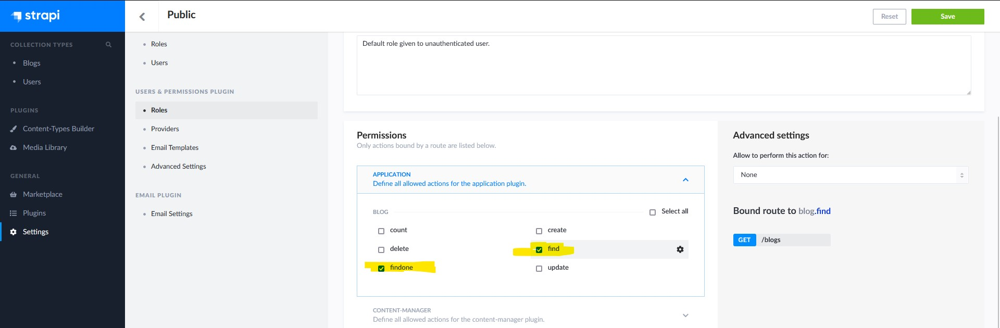
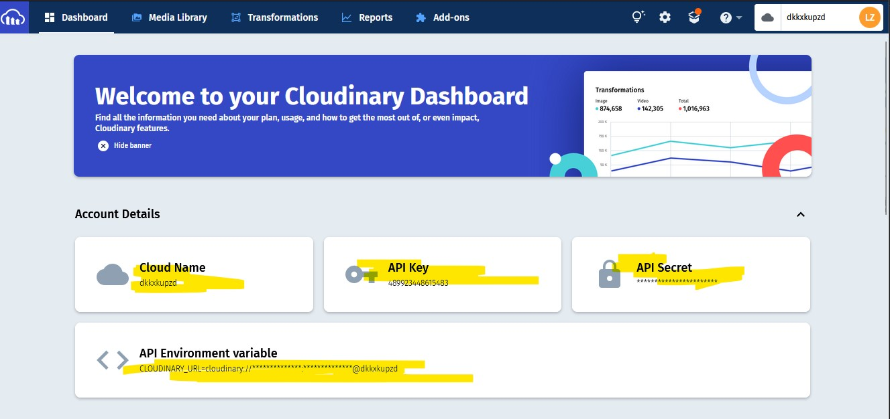
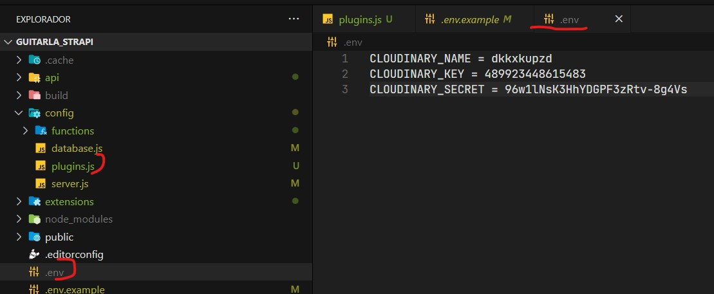
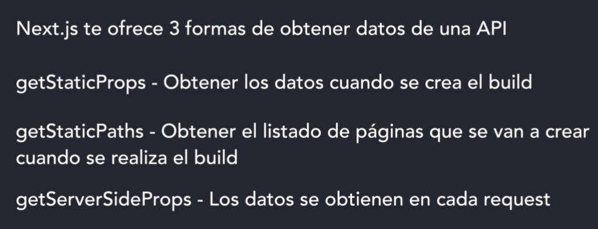

## **Crear Proyecto NEXT JS**

[**Acerca de next ->**](./ABOUT_NEXT.md)

```npx create-next-app@latest```

**Ejecutar proyecto:** ```npm run dev```

---


---

## **Routing**

Se utiliza la carpeta **pages** para todas las rutas a las que accederemos.
Por ejemplo: pages/nosotros.js -> localhost:3000/nosotros

No se necesita algo como es el react router. Para preservar el comportamiento de evitar la recarga de la página al interactuar con esta:

```js

// Hay componentes creados para next
import Link from 'next/link'

...

<Link href='/nosotros'> Ir a Nosotros </Link>

```

---

## **Head en Next**
> El componente Head equivale a la etiqueta head de html, por lo que ahí se puede colocar la etiqueta title entre otras. 
> Donde se importe se hará referencia a ese contenido.

```js
import Head from 'next/head'
...

<Head> 
    <title>Guitar LA- {pagina}</title>
    <meta name='description' content='Sitio Web de venta de guitarras' />
</Head>
```

**Link para el Routing**
```js
import Link from 'next/link'
...

```

---

## **Módulos CSS**
Crear **componente.module.css**

```js
// Para importar el modulo de css
import styles from '../styles/Header.module.css'

...

// Para aplicar las clases

<h1 className={styles.h1}>  </h1>
```
---

## **Imagenes en next**

```js
// Las imagenes estan en la carpeta public
import Image from 'next/image';

...

// Next ya apunta a la raiz de la carpeta public, height y width obligatorio
 <Image width={400} height={100} src='/img/logo.svg' alt='logo'/>

 // Layout
 <Image layout='' src='' alt=''/>
 // fill - ocupa todo el ancho de la pantalla
 // responsive - Se ajusta el tamaño a la redimensión de la ventana, ancho y alto
 // instrinsic - Escala solo en el ancho de la pantalla
 // fixed - la imagen se queda fija a un tamaño establecido

```

---

## [**Strapi**](https://strapi.io/)
CMS Headless 
- Permite crear API´s dinamicas con respuestas JSON o graphql

> Un CMS (Content Management System) o Sistema de Gestión de Contenidos es un sistema online que permite poner en marcha una página web de forma sencilla y rápida. Se trata de un software que te ayuda a administrar contenidos dinámicos, por ejemplo, un blog, un ecommerce o cualquier tipo de página web.


## **Strapi y Bases de datos**
Soporta
- sqlite
- Postgre
- Mongo

### **Para usar Mongo**
Servicio en nube para pruebas:
[Crear cuenta y base de datos en MongoDB Atlas](https://www.mongodb.com/atlas/database)

**Instalación** <br>

```npx create-strapi-app  npx create-strapi-app@3.6.8```

Existe hasta la version 4. En el caso de la v3, se utiliza node <= v14.0

1. Custom Installation
2. No template
3. mongo db client
4. set database name


En la página de atlas tenemos acceso a un string de conección, el cual debemos utilizar para enlazar con mongodb compass.


Desde MongoCompass:


**Ejecución** <br>
Una vez creado el proyecto para ejecutar, desde la ruta del proyecto: <br>

```npm run develop```

Se inicia un login para el proyectom, y de esta manera tener acceso al panel de control para gestionar el contenido.


---

## **Tipos de Contenido strapi**

Se crean colecciones como una manera de agrupar el contenido. Por ejemplo: blogs, productos, noticias, etc.


En este caso creamos el tipo de coleccion blog


Seleccionamos todos los campos que tendrá un blog para ser rellenado.


Una vez creado, si recargamos la pagina podremos ver que tenemos la opción de blog desde el panel de control. Dentro de ese apartado ya se pueden agregar entradas para la coleccion de blogs.


Se llenan los campos y de esta manera se tendrá informacion relevante que podrá ser consultada mas adelante en formato json gracias a la API.


Para que la informacion pueda ser consultada se debe ir a la opcion de settings. Desde ahí buscar el apartado de roles y editar el perfil público.


En este caso se habilitan las opciones de find y findone para permitir las consultas GET a la API


---

<br>

## **Imagenes en un servidor externo**

Crear una cuenta en [Cloudinary](https://cloudinary.com/).

Desde esta pagina podremos ver opciones importantes para enlazar el servidor de imagenes:


### **Instalar cloudinary en Strapi**
Desde el proyecto de strapi para [instalar con npm](
https://www.npmjs.com/package/@strapi/provider-upload-cloudinary) : 

```npm i @strapi/provider-upload-cloudinary```


Creamos un archivo de variables de entorno donde colocaremos los datos de la página y posteriormente crearemos un archivo en una carpeta config/**plugins.js**


Colocaremos el siguiente contenido:

```js
module.exports = ({ env }) => ({
    // ...
    upload: {
      config: {
        provider: 'cloudinary',
        providerOptions: {
          cloud_name: env('CLOUDINARY_NAME'),
          api_key: env('CLOUDINARY_KEY'),
          api_secret: env('CLOUDINARY_SECRET'),
        },
        actionOptions: {
          upload: {},
          uploadStream: {},
          delete: {},
        },
      },
    },
    // ...
  });
```

---

## Consultar APIs con NEXT




/** @type {import('next').NextConfig} */
const nextConfig = {
  reactStrictMode: true,
  swcMinify: true,
  images:{
    domains:['localhost']
  }
}

module.exports = nextConfig


.resumen{
    display: -webkit-box;
    -webkit-box-orient: vertical;
    -webkit-line-clamp: 3;  
    overflow: scroll;
}


---

## **Routing Dinámico**

Desde la carpeta pages se debe crear un directorio con el nombre de la url de la cual descenderan dinamicamente
Por ejemplo:

Pages/blog    --> blog/12   blog/21   blog/1

Posteriormente dentro de la carpeta blog se crea el componente con nombre del parametro en corchetes
Por ejemplo: [id].js
Lo anterior funciona como un comodín


import {useRouter} from 'next/router'

Para leer parametros de la url.

const router = useRouter();
console.log(router.query);

```js
import React from 'react'

const EntradaBlog = ({entrada}) => {

    console.log(entrada)

  return (
    <div>
        <h1>Desde Entrada Blog</h1>
    </div>
  )
}

export async function getServerSideProps({query:{id}}){
    console.log(id)

    const url = `http://localhost:1337/blogs/${id}`
    const response = await fetch(url);
    const result = await response.json();

    return {
        props:{ 
            entrada: result,
        }
    }
}

export default EntradaBlog
```


```js
export async function getStaticPaths(){
    const url = `http://localhost:1337/blogs`
    const response = await fetch(url);
    const result = await response.json();

    const paths = result.map(entrada => ({
        params: {id: entrada.id.toString()}
    }))

    return {
        paths,
        // true -> Retornar algunas rutas estaticamente y las otras se generan como se van solicitando. Ideal para millones de entradas
        // false -> Pasar todas las rutas que se van a construir. Ideal para pocas.
        // 'blocking' 
        fallback: false
    }
}

export async function getStaticProps({params:{id}}){
    console.log(id)

    const url = `http://localhost:1337/blogs/${id}`
    const response = await fetch(url);
    const result = await response.json();

    return {
        props:{ 
            entrada: result,
        }
    }
}
```


---

## **Variables de Entorno en NEXT**
Crear variables
.env.local

```JS

API_URL = http://localhost:1337   //Para consumirse en el servidor

NEXT_PUBLIC_API_URL = http://localhost:1337   // Para consumirse en el cliente

...

const url = `${process.env.API_URL}/blogs`
```


.texto {
    white-space: pre-wrap;
}

routing dinámico error 404

---

Routing amigable

La idea es que las url no sean tan variables como podría ser siempre apuntar hacia un ID.

En el caso de Strapi 
/blogs/mi-pagina  Routing dinamico para el front
/blogs?url=mi-pagina   filtros para consultar a la API de Strapi


```js

  const url = `${process.env.API_URL}/guitarras?_sort=precio:desc`;
```

## **Multiples fetch sin perder Performance**
```js

  // Manera menos óptima
  const url = `${process.env.API_URL}/guitarras?_sort=createdAt:desc`;
  const response = await fetch(url);
  const result = await response.json();

  const url2 = `${process.env.API_URL}/seccion`;
  const response2 = await fetch(url);
  const result2 = await response.json();


  // Realizar al mismo tiempo con promise all
  const urlGuitarras = `${process.env.API_URL}/guitarras?_sort=createdAt:desc`;
  const urlSeccionCursos = `${process.env.API_URL}/seccion-cursos`;

  const [resGuitarras,resSeccion] = await Promise.all([
    fetch(urlGuitarras),
    fetch(urlSeccionCursos)
  ])

  const [guitarras,seccion] = await Promise.all([
    resGuitarras.json(),
    resSeccion.json()
  ])


```

---

## **Alternativas para el CSS**

Este código css solo afecta al componente.

```JS
<section style={{
     backgroundColor: 'red'
 }}>
     ...
</section>

 // También:

<section>
     ...
  <style jsx>{`
      section{
          background-color:red;
      }
  `}</style>
</section>
```


  const urlBlogs = `${process.env.API_URL}/blogs?_limit=3`

  ---

  ## **Animacion de guitarra en el header**

  ```js
  import {useRouter} from 'next/router'
  ...

  const router = useRouter;
  ...

// Si estoy en la página de inicio
{router.pathname === '/' && (
 
)}
  ```

```css
.guitarra{
  display: block;
  position: absolute;
  right: 0;
  bottom: 0;

  animation-name: mostrarImagen;
  animation-duration: 1s;
  animation-iteration-count: 1;
  animation-delay: 0s;
  animation-timing-function: ease-in-out;
}

@keyframes mostrarImagen{
    0% {
        opacity: 0;
        transform: translateX(-10rem);
    }

    50%{
        opacity: 0;
    }

    100%{
        opacity: 1;
        transform: translateX(0);
    }
}
```

---

## **State en Next**

Para tener un State "global" se debe utilizar el hook useState en el archivo _app.js en pages.
Se manda el state como props y se puede obtener en cualquier componente desestructurando la propiedad.

```js
import '../styles/normalize.css'
import '../styles/globals.css'

import { useState } from 'react'

function MyApp({ Component, pageProps }) {
  const [carrito, setCarrito] = useState([]);

  return <Component 
    {...pageProps} 
    carrito={carrito}
  />
}

export default MyApp

```

---

## Quitarle estilos css a un elemento

```css
.select {
    all: unset
}
```

```js
  useEffect(() => { 
    const calculoTotal = carrito.reduce( (total,producto) => total+ (producto.cantidad*producto.precio),0);

    setTotal(calculoTotal);
  },[carrito]);

```
